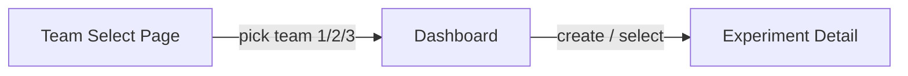

# IoT Workshop Frontend Dashboard

## Project Location

`/Users/are/dev/contract/vhk_inseneeria/2026/frontend` -- sibling to `backend/`.

## Scaffolding

- `npm create vite@latest frontend -- --template react-ts`
- Install Tailwind CSS v4 (Vite plugin)
- Initialize shadcn/ui (`npx shadcn@latest init`)
- Add shadcn components: `button`, `card`, `input`, `badge`, `table`, `dialog`, `tabs`, `sonner` (toasts)

## Application Flow



**Two routes** via React Router:

- `/` -- Team selection (pick team 1, 2, or 3; register a name)
- `/teams/:teamId` -- Team dashboard with experiments list, create experiment, and experiment detail panel

## Page Designs

### 1. Team Selection (`/`)

- Fetch `GET /teams` on mount
- Display 3 cards (one per team) showing team id and name (or "Unregistered")
- Each card has a text input + "Register" button calling `POST /teams/{id}/register`
- Clicking a registered team navigates to `/teams/{id}`

### 2. Team Dashboard (`/teams/:teamId`)

Split into two panels (sidebar + main):

**Left sidebar -- Experiments list:**
- Fetch `GET /teams/{teamId}/experiments`
- "New Experiment" button opens a dialog with name input, calls `POST /teams/{teamId}/experiments`
- Each experiment shows name, status badge (active/stopped/idle), click to select

**Main panel -- Selected Experiment detail (tabs):**

- **Overview tab:** experiment name, status, started_at, stopped_at. Start/Stop buttons calling `POST /experiments/{id}/start` and `POST /experiments/{id}/stop`. Download buttons for CSV exports (simple `<a>` links to `/experiments/{id}/export/sensor-data.csv` and `/experiments/{id}/export/metrics.csv`).
- **Metrics tab:** table of metrics from `GET /experiments/{id}/metrics`. Form at the bottom (name + value inputs) to add a metric via `POST /experiments/{id}/metrics`.
- **Sensor Data tab:** table of sensor readings from `GET /experiments/{id}/sensor-data` showing timestamp, acceleration x/y/z, heart rate.

## Project Structure

```
frontend/
  src/
    main.tsx                 -- React entry, router setup
    App.tsx                  -- Router outlet
    lib/
      api.ts                 -- fetch wrapper, base URL config, typed API functions
      types.ts               -- TS interfaces matching OpenAPI schemas
    pages/
      TeamSelectPage.tsx     -- team cards with registration
      TeamDashboardPage.tsx  -- sidebar + main experiment panel
    components/
      ExperimentList.tsx     -- sidebar experiment list + create dialog
      ExperimentDetail.tsx   -- tabbed experiment view (overview, metrics, sensor data)
      MetricsTable.tsx       -- metrics list + add form
      SensorDataTable.tsx    -- sensor data table
```

## Key Files

### `lib/types.ts` -- TypeScript types derived from OpenAPI schemas

```typescript
export interface Team {
  id: number;
  name: string | null;
  created_at: string;
}
export interface Experiment {
  id: number;
  name: string;
  team_id: number;
  is_active: boolean;
  started_at: string | null;
  stopped_at: string | null;
  created_at: string;
}
export interface Metric {
  id: number;
  experiment_id: number;
  name: string;
  value: number;
  created_at: string;
}
export interface SensorData {
  id: number;
  team_id: number;
  experiment_id: number | null;
  acceleration_x: number;
  acceleration_y: number;
  acceleration_z: number;
  heart_rate: number;
  timestamp: string;
}
```

### `lib/api.ts` -- Typed API client

All functions use `fetch` against `API_BASE` (defaulting to `http://localhost:8000`). Functions:
- `getTeams()`, `registerTeam(teamId, name)`
- `getExperiments(teamId)`, `createExperiment(teamId, name)`
- `startExperiment(id)`, `stopExperiment(id)`
- `getMetrics(expId)`, `addMetric(expId, name, value)`
- `getSensorData(expId)`
- `exportSensorDataUrl(expId)`, `exportMetricsUrl(expId)` -- return URL strings for download links

### Vite proxy

Configure `vite.config.ts` to proxy `/api` to `http://localhost:8000` so the frontend can run on a different port during development without CORS issues. The `api.ts` base URL will use `/api` prefix, and the Vite proxy will strip it.

## Theme -- Dark Mode, Cursor-Inspired

Initialize shadcn with the **neutral** base color and **dark** mode as default (no light mode toggle needed). The resulting palette will closely match Cursor's aesthetic:

- **Background:** near-black (`#0a0a0a` / neutral-950)
- **Card / surface:** dark gray (`#171717` / neutral-900)
- **Borders:** subtle gray (`#262626` / neutral-800)
- **Primary accent:** blue (`#3b82f6` / blue-500) for primary buttons and active states
- **Text:** white/gray (`#fafafa` primary, `#a3a3a3` muted)
- **Status badges:** green for active experiments, red/muted for stopped, gray for idle

This is achieved by selecting `neutral` base + `dark` style during `npx shadcn@latest init`. No custom CSS variables needed beyond shadcn defaults.

## shadcn/ui Components Used

- `Card` -- team selection cards
- `Button` -- actions (register, start, stop, create, download)
- `Input` -- team name, experiment name, metric name/value
- `Badge` -- experiment status (active = green, stopped = destructive, idle = secondary)
- `Table` -- metrics and sensor data
- `Dialog` -- create experiment modal
- `Tabs` -- experiment detail sections (overview, metrics, sensor data)
- `Sonner` -- toast notifications for success/error feedback
